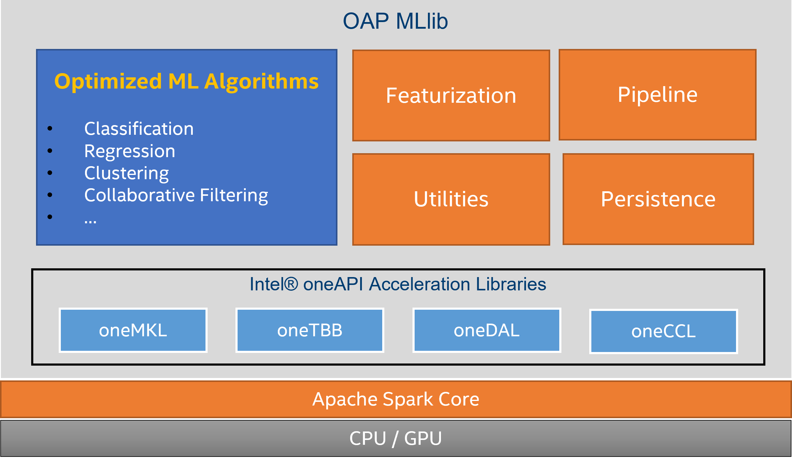

##### \* LEGAL NOTICE: Your use of this software and any required dependent software (the "Software Package") is subject to the terms and conditions of the software license agreements for the Software Package, which may also include notices, disclaimers, or license terms for third party or open source software included in or with the Software Package, and your use indicates your acceptance of all such terms. Please refer to the "TPP.txt" or other similarly-named text file included with the Software Package for additional details.

##### \* Optimized Analytics Package for Spark* Platform is under Apache 2.0 (https://www.apache.org/licenses/LICENSE-2.0).

# Introduction

## The Problem

[Apache Spark MLlib](https://spark.apache.org/mllib) is a scalable machine learning library based on Spark unified platform. It seamlessly integrates with Spark SQL, Spark Streaming and other machine learning and deep learning frameworks without additional glue code for the entire pipeline.

However, JVM-based MLlib only has limited use of BLAS acceleration and Spark shuffle is also slow for communication during distributed training. Spark's original design is CPU-centric that can't leverage GPU acceleration. It doesn't fully utilize modern CPU and GPU capabilities to achieve best performance.

## OAP MLlib Solution

OAP MLlib is a platform optimized package to accelerate machine learning algorithms in Apache Spark MLlib.  It is compatible with Spark MLlib and leverages open source [Intel® oneAPI Data Analytics Library (oneDAL)](https://github.com/oneapi-src/oneDAL) to provide highly optimized algorithms and get most out of CPU and GPU capabilities. It also take advantage of open source [Intel® oneAPI Collective Communications Library (oneCCL)](https://github.com/oneapi-src/oneCCL) to provide efficient communication patterns in multi-node multi-GPU clusters.

## Who will use OAP MLlib

This solution is intended for researchers, data scientists and enterprise users to accelerate their Spark MLlib algorithms with minimum configuration changes.

# Architecture

The following diagram shows the high-level architecture of OAP MLlib.



OAP MLlib maintains the same API interfaces with Spark MLlib. Both Python and Scala languages are supported. That means the application built with Spark MLlib can be running directly with minimum configuration.

Most of the algorithms can produce the same results that are identical with Spark MLlib. However due to the nature of distributed float point operations, there may be some small deviation from the original result, we will make sure the error is within acceptable range and the accuracy is on par with Spark MLlib.

For those algorithms that are not accelerated by OAP MLlib, the original Spark MLlib one will be used.

# Online Documentation

You can find the all the OAP MLlib documents on the [project web page](https://oap-project.github.io/oap-mllib).

# Getting Started

## Python/PySpark Users Preferred

Use a pre-built JAR to get started. If you have finished [OAP Installation Guide](./docs/OAP-Installation-Guide.md), you can find compiled OAP MLlib JAR `oap-mllib-x.x.x.jar` in `$HOME/miniconda2/envs/oapenv/oap_jars/`.

Then you can refer to the following [Running](#running) section to try out.

## Java/Scala Users Preferred

Use a pre-built OAP MLlib JAR to get started, you can download OAP MLlib JAR from [Release Page](https://github.com/oap-project/oap-mllib/releases/download/v1.5.0/oap-mllib-1.5.0.jar).

Then you can refer to the following [Running](#running) section to try out.

## Building From Scratch

You can also build the package from source code, please refer to [Building Code](#building-code) section.

## Running

### Prerequisites

* Generally, our common system requirements are the same with Intel® oneAPI Toolkit, please refer to [Intel® oneAPI Base Toolkit System Requirements](https://software.intel.com/content/www/us/en/develop/articles/intel-oneapi-base-toolkit-system-requirements.html) for details.

* Please follow [this guide](https://www.intel.com/content/www/us/en/docs/oneapi/installation-guide-linux/2023-1/install-using-package-managers.html) to install Intel® oneAPI Runtime Library Packages using package managers.
The following runtime packages with all their dependencies should be installed in __all cluster nodes__:
  ```
  intel-oneapi-runtime-dal
  intel-oneapi-runtime-ccl
  ```
* (Optional) If you plan to use Intel GPU, [install the Intel GPU drivers](https://www.intel.com/content/www/us/en/docs/oneapi/installation-guide-linux/2023-1/install-intel-gpu-drivers.html). Otherwise only CPU is supported.

### Supported Spark Versions

* Apache Spark 3.1.1
* Apache Spark 3.1.2
* Apache Spark 3.1.3
* Apache Spark 3.2.0
* Apache Spark 3.2.1
* Apache Spark 3.2.2

### Supported Intel® oneAPI Toolkits

* Intel® oneAPI Toolkits >= 2023.1

### Spark Configuration

#### General Configuration

##### Standalone Cluster Manager
For using standalone cluster manager, you need to upload the jar to every node or use shared network folder and then specify absolute paths for extraClassPath.

```
# absolute path of the jar for driver class path
spark.driver.extraClassPath       /path/to/oap-mllib-x.x.x.jar
# absolute path of the jar for executor class path
spark.executor.extraClassPath     /path/to/oap-mllib-x.x.x.jar
```

##### YARN Cluster Manager
For users running Spark application on __YARN__ with __client__ mode, you only need to add the following configurations in `spark-defaults.conf` or in `spark-submit` command line before running.

```
# absolute path of the jar for uploading
spark.files                       /path/to/oap-mllib-x.x.x.jar
# absolute path of the jar for driver class path
spark.driver.extraClassPath       /path/to/oap-mllib-x.x.x.jar
# relative path of the jar for executor class path
spark.executor.extraClassPath     ./oap-mllib-x.x.x.jar
```
__Note: Intel GPUs are not fully supported in YARN Cluster Manager, please use Standalone mode.__

#### OAP MLlib Specific Configuration

`spark.oap.mllib.device` is used to select compute device, you can set it as `CPU` or `GPU`. Default value is `CPU` if it's not specified. Please check [List of Accelerated Algorithms](#list-of-accelerated-algorithms) for supported algorithms of each compute device.

OAP MLlib adopted oneDAL as implementation backend. oneDAL requires enough native memory allocated for each executor. For large dataset, depending on algorithms, you may need to tune `spark.executor.memoryOverhead` to allocate enough native memory. Setting this value to larger than __dataset size / executor number__ is a good starting point.

OAP MLlib expects 1 executor acts as 1 oneCCL rank for compute. As `spark.shuffle.reduceLocality.enabled` option is `true` by default, when the dataset is not evenly distributed accross executors, this option may result in assigning more than 1 rank to single executor and task failing. The error could be fixed by setting `spark.shuffle.reduceLocality.enabled` to `false`.

### Sanity Check

#### Setup `env.sh`
```bash
    $ cd conf
    $ cp env.sh.template env.sh
```
Edit related variables in "`Minimun Settings`" of `env.sh`

#### Run K-means

```bash
    $ cd examples/python/kmeans-pyspark
    $ ./run-cpu.sh
```

## Building Code

### Prerequisites

We use [Apache Maven](https://maven.apache.org/) to manage and build source code.  The following tools and libraries are also needed to build OAP MLlib:

* JDK 8.0+
* Apache Maven 3.6.2+
* GNU GCC 7+
* Intel® oneAPI Base Toolkit Components:
    - DPC++/C++ Compiler (icpx)
    - Data Analytics Library (oneDAL)
    - Threading Building Blocks (oneTBB)
    - Collective Communications Library (oneCCL)

Generally you only need to install __Intel® oneAPI Base Toolkit for Linux__ with all or selected components mentioned above. Intel® oneAPI Base Toolkit can be downloaded and installed from [here](https://software.intel.com/content/www/us/en/develop/tools/oneapi.html). Installation process for oneAPI using Package Managers (YUM (DNF), APT, and ZYPPER) is also available. More details about oneAPI can be found [here](https://software.intel.com/content/www/us/en/develop/tools/oneapi.html).

Scala and Java dependency descriptions are already included in Maven POM file.

***Note:*** You can refer to [this script](dev/install-build-deps-ubuntu.sh) to install correct dependencies.

### Build

To clone and checkout source code, run the following commands:
```bash
    $ git clone https://github.com/oap-project/oap-mllib.git
```
__Optional__ to checkout specific release branch:
```bash
    $ cd oap-mllib && git checkout ${version}
```

We rely on environment variables to find required toolchains and libraries. Please make sure the following environment variables are set for building:

Environment | Description
------------| -----------
JAVA_HOME   | Path to JDK home directory
DAALROOT    | Path to oneDAL home directory
TBB_ROOT    | Path to oneTBB home directory
CCL_ROOT    | Path to oneCCL home directory

We suggest you to source `setvars.sh` script into current shell to setup building environments as following:

```bash
    $ source /opt/intel/oneapi/setvars.sh
```

You can also refer to [this CI script](dev/ci/ci-build-test.sh) to setup the building environments.

If you prefer to buid your own open source [oneDAL](https://github.com/oneapi-src/oneDAL), [oneTBB](https://github.com/oneapi-src/oneTBB), [oneCCL](https://github.com/oneapi-src/oneCCL) versions rather than use the ones included in oneAPI Base Toolkit, you can refer to the related build instructions and manually source `setvars.sh` accordingly.

To build, run the following commands:
```bash
    $ cd mllib-dal
    $ ../dev/prepare-build-deps.sh
    $ ./build.sh
```

The built JAR package will be placed in `target` directory with the name `oap-mllib-x.x.x.jar`.

## Examples

### Python Examples

Example                           |  Description
----------------------------------|---------------------------
kmeans-pyspark                    |  K-means example for PySpark
pca-pyspark                       |  PCA example for PySpark
als-pyspark                       |  ALS example for PySpark
random-forest-classifier-pyspark  |  Random Forest Classifier example for PySpark
random-forest-regressor-pyspark   |  Random Forest Regressor example for PySpark
correlation-pyspark               |  Correlation example for pyspark
summarizer-pyspark                |  Summarizer example for pyspark

### Scala Examples

Example                  |  Description
-------------------------|-------------------------------------
kmeans-scala             |  K-means example for Scala
pca-scala                |  PCA example for Scala
als-scala                |  ALS example for Scala
naive-bayes              |  Naive Bayes example for Scala
linear-regression-scala  |  Linear Regression example for Scala
correlation-scala        |  Correlation example for Scala
summarizer-scala         |  Summarizer example for Scala

__Note: Not all examples have both CPU or GPU version, please check [List of Accelerated Algorithms](#list-of-accelerated-algorithms) section.__

## List of Accelerated Algorithms

Algorithm                 | CPU | GPU |
--------------------------|-----|-----|
K-Means                   | X   | X   |
PCA                       | X   | X   |
ALS                       | X   |     |
Naive Bayes               | X   |     |
Linear Regression         | X   | X   |
Ridge Regression          | X   |     |
Random Forest Classifier  |     | X   |
Random Forest Regressor   |     | X   |
Correlation               | X   | X   |
Summarizer                | X   | X   |
